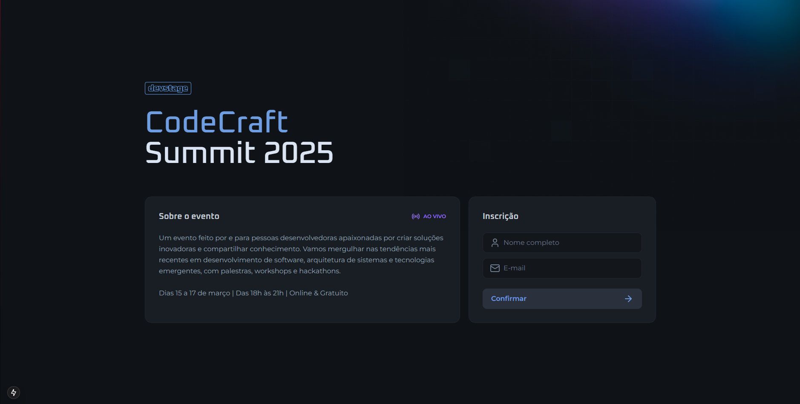

  

# Event App

A web application for event referrals, allowing users to access their tickets, generate invitation links, and view the referral ranking.

## Tech Stack

## Getting Started

1. **Install Dependencies**: `npm install` or `yarn`
2. **Start Development Server**: `npm run dev`

## Contribute

1. **Clone project**: `git clone https://github.com/ricardotemporal/event-referral-app.git`
2. **Create feature/branch**: `git checkout -b feature/NAME`

## <a name="authors">👥 Authors</a>

<table style="border-collapse: collapse; table-layout: auto text-align: left;">
  <tbody>
    <tr>
      <td style="padding: 10px; border: 1px solid #ddd;">
        
      </td>
      <td style="padding: 10px; border: 1px solid #ddd;">Ricardo Temporal</td> 
      <td style="padding: 10px; border: 1px solid #ddd;">
        <a href="https://www.linkedin.com/in/ricardotemporal/" target="_blank">LinkedIn</a> | 
        <a href="https://github.com/ricardotemporal" target="_blank">GitHub</a> 
      </td>
    </tr>
    <tr>
      <td style="padding: 10px; border: 1px solid #ddd;">
        
      </td>
      <td style="padding: 10px; border: 1px solid #ddd;">Diego Fernandes</td> 
      <td style="padding: 10px; border: 1px solid #ddd;">
        <a href="https://www.linkedin.com/in/diego-schell-fernandes/" target="_blank">LinkedIn</a> | 
        <a href="https://github.com/diego3g" target="_blank">GitHub</a> 
      </td>
    </tr>
  </tbody>
</table>
